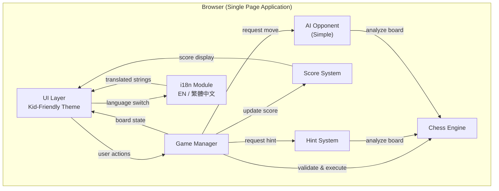
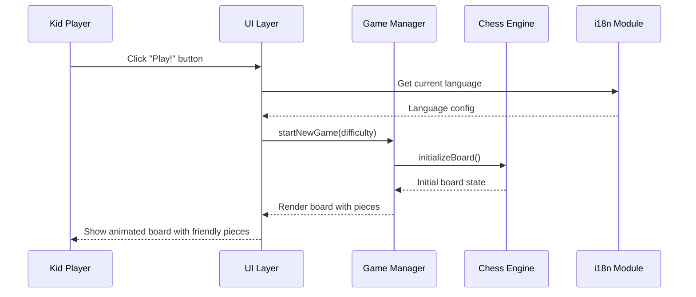
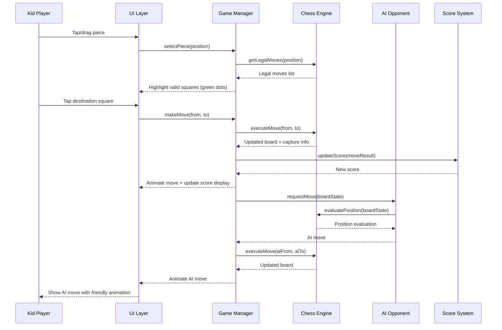
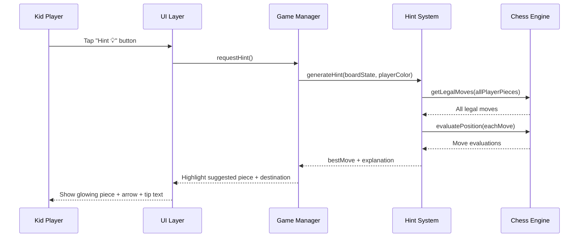

# Design Document: Kids Chess Game

## Overview

This feature is a kid-friendly, web-based chess game designed for young learners. The game provides an interactive, colorful, and intuitive chess experience with simplified controls, visual move suggestions, a scoring system to encourage learning, and bilingual support for English and Traditional Chinese (繁體中文).

The application prioritizes accessibility and engagement for children aged 5-12. Large, friendly chess pieces with animations, drag-and-drop or tap-to-move controls, and a cheerful UI make the game approachable. A built-in hint system highlights suggested moves to help kids learn chess strategy, while a score tracker rewards good play and encourages continued learning.

The game runs entirely in the browser as a single-page web application. No server-side logic is required for the core gameplay — all chess logic, scoring, and hint generation run client-side. The language toggle allows seamless switching between English and Traditional Chinese without page reload.

## Architecture



## Sequence Diagrams

### Game Start Flow



### Player Move Flow



### Hint Request Flow



## Components and Interfaces

### Component 1: Game Manager

**Purpose**: Central coordinator that manages game state, turn flow, and communication between all subsystems.

```pascal
INTERFACE GameManager
  startNewGame(difficulty: Difficulty): GameState
  restartGame(): GameState
  selectPiece(position: Position): LegalMoves
  makeMove(from: Position, to: Position): MoveResult
  requestHint(): HintResult
  undoLastMove(): GameState
  getGameState(): GameState
  setLanguage(lang: Language): VOID
END INTERFACE
```

**Responsibilities**:
- Manage turn alternation between player and AI
- Coordinate move validation through Chess Engine
- Trigger score updates after each move
- Handle game-over detection (checkmate, stalemate, draw)
- Manage game restart and undo operations

### Component 2: Chess Engine

**Purpose**: Core chess logic — board representation, move generation, move validation, and position evaluation.

```pascal
INTERFACE ChessEngine
  initializeBoard(): Board
  getLegalMoves(board: Board, position: Position): List<Move>
  executeMove(board: Board, move: Move): MoveResult
  isCheck(board: Board, color: Color): Boolean
  isCheckmate(board: Board, color: Color): Boolean
  isStalemate(board: Board, color: Color): Boolean
  evaluatePosition(board: Board): Score
  getAllLegalMoves(board: Board, color: Color): List<Move>
END INTERFACE
```

**Responsibilities**:
- Maintain legal move generation for all piece types
- Enforce chess rules (castling, en passant, pawn promotion)
- Detect check, checkmate, and stalemate conditions
- Provide position evaluation for AI and hint system

### Component 3: AI Opponent

**Purpose**: Simple AI that plays against the kid at adjustable difficulty levels.

```pascal
INTERFACE AIOpponent
  selectMove(board: Board, difficulty: Difficulty): Move
  setDifficulty(level: Difficulty): VOID
END INTERFACE
```

**Responsibilities**:
- Generate moves appropriate to the selected difficulty
- Easy mode: mostly random with occasional good moves
- Medium mode: basic material-aware decisions
- Intentionally make suboptimal moves to keep the game fun for kids

### Component 4: Score System

**Purpose**: Track and display scores to motivate and reward the player.

```pascal
INTERFACE ScoreSystem
  updateScore(event: ScoreEvent): ScoreState
  resetScore(): ScoreState
  getScore(): ScoreState
  getHighScore(): Number
END INTERFACE
```

**Responsibilities**:
- Award points for captures, checkmate, and using hints wisely
- Track current game score and all-time high score (localStorage)
- Display score with kid-friendly animations (stars, sparkles)

### Component 5: Hint System

**Purpose**: Analyze the board and suggest good moves with kid-friendly explanations.

```pascal
INTERFACE HintSystem
  generateHint(board: Board, color: Color): HintResult
  getHintExplanation(move: Move, lang: Language): String
END INTERFACE
```

**Responsibilities**:
- Evaluate all legal moves and pick the best one
- Generate simple, encouraging explanations in the active language
- Visually highlight the suggested piece and destination square

### Component 6: i18n Module

**Purpose**: Manage bilingual text for English and Traditional Chinese.

```pascal
INTERFACE I18nModule
  setLanguage(lang: Language): VOID
  getLanguage(): Language
  translate(key: String): String
  translate(key: String, params: Map<String, String>): String
END INTERFACE
```

**Responsibilities**:
- Store translation strings for EN and ZH-TW
- Provide reactive language switching without page reload
- Translate UI labels, hint explanations, score messages, and game status text

## Data Models

### Board

```pascal
STRUCTURE Board
  squares: Array[8][8] OF Piece OR NULL
  currentTurn: Color
  moveHistory: List<MoveRecord>
  castlingRights: CastlingRights
  enPassantTarget: Position OR NULL
  halfMoveClock: Number
  fullMoveNumber: Number
END STRUCTURE
```

### Piece

```pascal
STRUCTURE Piece
  type: PieceType
  color: Color
END STRUCTURE

ENUMERATION PieceType
  KING, QUEEN, ROOK, BISHOP, KNIGHT, PAWN
END ENUMERATION

ENUMERATION Color
  WHITE, BLACK
END ENUMERATION
```

### Position and Move

```pascal
STRUCTURE Position
  row: Number  // 0-7
  col: Number  // 0-7
END STRUCTURE

STRUCTURE Move
  from: Position
  to: Position
  promotion: PieceType OR NULL
END STRUCTURE

STRUCTURE MoveRecord
  move: Move
  capturedPiece: Piece OR NULL
  wasCheck: Boolean
  notation: String
END STRUCTURE
```

### Game State

```pascal
STRUCTURE GameState
  board: Board
  status: GameStatus
  playerColor: Color
  difficulty: Difficulty
  score: ScoreState
  hintsUsed: Number
END STRUCTURE

ENUMERATION GameStatus
  NOT_STARTED, IN_PROGRESS, CHECK, CHECKMATE, STALEMATE, DRAW, RESIGNED
END ENUMERATION

ENUMERATION Difficulty
  EASY, MEDIUM
END ENUMERATION
```

### Score State

```pascal
STRUCTURE ScoreState
  currentScore: Number
  capturePoints: Number
  checkmateBonus: Number
  hintPenalty: Number
  highScore: Number
END STRUCTURE

STRUCTURE ScoreEvent
  type: ScoreEventType
  value: Number
END STRUCTURE

ENUMERATION ScoreEventType
  PIECE_CAPTURED, CHECKMATE_WIN, HINT_USED, GAME_COMPLETED
END ENUMERATION
```

### Hint Result

```pascal
STRUCTURE HintResult
  suggestedMove: Move
  explanation: String
  confidence: Number  // 0.0 to 1.0
END STRUCTURE
```

### i18n

```pascal
STRUCTURE Language
  code: String        // "en" or "zh-TW"
  displayName: String // "English" or "繁體中文"
END STRUCTURE

STRUCTURE TranslationMap
  entries: Map<String, String>
END STRUCTURE
```

**Validation Rules**:
- Position row and col must be in range 0-7
- Move must be a legal chess move validated by the engine
- Score values must be non-negative
- Language code must be "en" or "zh-TW"
- Difficulty must be EASY or MEDIUM


## Algorithmic Pseudocode

### Main Game Loop Algorithm

```pascal
ALGORITHM mainGameLoop(gameState)
INPUT: gameState of type GameState
OUTPUT: updated GameState

BEGIN
  ASSERT gameState.status = IN_PROGRESS

  // Player's turn
  WHILE gameState.status = IN_PROGRESS DO
    ASSERT gameState.board.currentTurn = gameState.playerColor

    // Wait for player input (event-driven)
    playerMove ← waitForPlayerMove(gameState)

    // Validate and execute player move
    moveResult ← executeValidatedMove(gameState.board, playerMove)
    gameState.board ← moveResult.updatedBoard

    // Update score based on move result
    IF moveResult.capturedPiece IS NOT NULL THEN
      scoreEvent ← CREATE ScoreEvent(PIECE_CAPTURED, pieceValue(moveResult.capturedPiece))
      gameState.score ← updateScore(gameState.score, scoreEvent)
    END IF

    // Check game-ending conditions
    gameState.status ← checkGameStatus(gameState.board, BLACK)
    IF gameState.status ≠ IN_PROGRESS THEN
      EXIT WHILE
    END IF

    // AI's turn
    aiMove ← aiSelectMove(gameState.board, gameState.difficulty)
    aiMoveResult ← executeValidatedMove(gameState.board, aiMove)
    gameState.board ← aiMoveResult.updatedBoard

    // Check game-ending conditions after AI move
    gameState.status ← checkGameStatus(gameState.board, WHITE)
  END WHILE

  RETURN gameState
END
```

**Preconditions:**
- gameState is initialized with a valid board
- gameState.status is IN_PROGRESS
- gameState.playerColor is set (WHITE by default)

**Postconditions:**
- gameState.status is one of: CHECKMATE, STALEMATE, DRAW, RESIGNED
- All moves in moveHistory are legal chess moves
- Score reflects all captures and events during the game

**Loop Invariants:**
- The board is always in a valid chess state
- currentTurn alternates between WHITE and BLACK each iteration
- moveHistory contains all moves executed so far in order

### Legal Move Generation Algorithm

```pascal
ALGORITHM getLegalMoves(board, position)
INPUT: board of type Board, position of type Position
OUTPUT: legalMoves of type List<Move>

BEGIN
  ASSERT isValidPosition(position)
  piece ← board.squares[position.row][position.col]
  ASSERT piece IS NOT NULL
  ASSERT piece.color = board.currentTurn

  pseudoLegalMoves ← List()

  // Generate pseudo-legal moves based on piece type
  CASE piece.type OF
    PAWN:   pseudoLegalMoves ← generatePawnMoves(board, position, piece.color)
    KNIGHT: pseudoLegalMoves ← generateKnightMoves(board, position, piece.color)
    BISHOP: pseudoLegalMoves ← generateSlidingMoves(board, position, piece.color, DIAGONAL_DIRECTIONS)
    ROOK:   pseudoLegalMoves ← generateSlidingMoves(board, position, piece.color, STRAIGHT_DIRECTIONS)
    QUEEN:  pseudoLegalMoves ← generateSlidingMoves(board, position, piece.color, ALL_DIRECTIONS)
    KING:   pseudoLegalMoves ← generateKingMoves(board, position, piece.color)
  END CASE

  // Filter out moves that leave own king in check
  legalMoves ← List()
  FOR EACH move IN pseudoLegalMoves DO
    ASSERT isValidPosition(move.to)
    simulatedBoard ← simulateMove(board, move)
    IF NOT isCheck(simulatedBoard, piece.color) THEN
      legalMoves.add(move)
    END IF
  END FOR

  RETURN legalMoves
END
```

**Preconditions:**
- board is a valid chess board state
- position contains a piece belonging to the current turn's color
- position row and col are in range 0-7

**Postconditions:**
- Every move in legalMoves is a legal chess move
- No move in legalMoves leaves the player's own king in check
- All special moves (castling, en passant, promotion) are included if legal

**Loop Invariants:**
- All moves added to legalMoves so far do not leave own king in check
- simulatedBoard is always restored/discarded after each check

### AI Move Selection Algorithm

```pascal
ALGORITHM aiSelectMove(board, difficulty)
INPUT: board of type Board, difficulty of type Difficulty
OUTPUT: selectedMove of type Move

BEGIN
  allMoves ← getAllLegalMoves(board, BLACK)
  ASSERT allMoves.length > 0

  IF difficulty = EASY THEN
    // 70% random, 30% best move
    randomValue ← random(0.0, 1.0)
    IF randomValue < 0.7 THEN
      selectedMove ← allMoves[random(0, allMoves.length - 1)]
    ELSE
      selectedMove ← findBestMove(board, allMoves, depth: 1)
    END IF

  ELSE IF difficulty = MEDIUM THEN
    // 30% random, 70% best move with depth 2
    randomValue ← random(0.0, 1.0)
    IF randomValue < 0.3 THEN
      selectedMove ← allMoves[random(0, allMoves.length - 1)]
    ELSE
      selectedMove ← findBestMove(board, allMoves, depth: 2)
    END IF
  END IF

  RETURN selectedMove
END
```

**Preconditions:**
- board is a valid chess state with BLACK to move
- At least one legal move exists for BLACK
- difficulty is EASY or MEDIUM

**Postconditions:**
- selectedMove is a legal move for BLACK
- On EASY: move quality is intentionally mixed to keep game fun
- On MEDIUM: move quality is moderately good but not optimal

**Loop Invariants:** N/A (no loops)

### Hint Generation Algorithm

```pascal
ALGORITHM generateHint(board, playerColor)
INPUT: board of type Board, playerColor of type Color
OUTPUT: hint of type HintResult

BEGIN
  allMoves ← getAllLegalMoves(board, playerColor)
  ASSERT allMoves.length > 0

  bestScore ← -INFINITY
  bestMove ← NULL

  FOR EACH move IN allMoves DO
    simulatedBoard ← simulateMove(board, move)
    score ← evaluatePosition(simulatedBoard) * directionMultiplier(playerColor)

    // Bonus for captures
    IF move captures a piece THEN
      score ← score + pieceValue(capturedPiece) * 0.1
    END IF

    // Bonus for checkmate
    IF isCheckmate(simulatedBoard, oppositeColor(playerColor)) THEN
      score ← INFINITY
    END IF

    IF score > bestScore THEN
      bestScore ← score
      bestMove ← move
    END IF
  END FOR

  explanation ← generateExplanation(bestMove, board, playerColor)

  RETURN HintResult(bestMove, explanation, normalize(bestScore))
END
```

**Preconditions:**
- board is a valid chess state
- playerColor has at least one legal move
- evaluatePosition returns a numeric score

**Postconditions:**
- hint.suggestedMove is the highest-evaluated legal move
- hint.explanation is a non-empty string in the active language
- hint.confidence is between 0.0 and 1.0

**Loop Invariants:**
- bestMove is always the move with the highest score seen so far
- bestScore is the evaluation of bestMove

### Score Update Algorithm

```pascal
ALGORITHM updateScore(scoreState, event)
INPUT: scoreState of type ScoreState, event of type ScoreEvent
OUTPUT: updatedScore of type ScoreState

BEGIN
  updatedScore ← COPY(scoreState)

  CASE event.type OF
    PIECE_CAPTURED:
      points ← calculateCapturePoints(event.value)
      updatedScore.capturePoints ← updatedScore.capturePoints + points
      updatedScore.currentScore ← updatedScore.currentScore + points

    CHECKMATE_WIN:
      bonus ← 100
      updatedScore.checkmateBonus ← bonus
      updatedScore.currentScore ← updatedScore.currentScore + bonus

    HINT_USED:
      penalty ← 5
      updatedScore.hintPenalty ← updatedScore.hintPenalty + penalty
      updatedScore.currentScore ← MAX(0, updatedScore.currentScore - penalty)

    GAME_COMPLETED:
      IF updatedScore.currentScore > updatedScore.highScore THEN
        updatedScore.highScore ← updatedScore.currentScore
        saveHighScore(updatedScore.highScore)
      END IF
  END CASE

  RETURN updatedScore
END

FUNCTION calculateCapturePoints(pieceType)
  CASE pieceType OF
    PAWN:   RETURN 10
    KNIGHT: RETURN 30
    BISHOP: RETURN 30
    ROOK:   RETURN 50
    QUEEN:  RETURN 90
    KING:   RETURN 0   // King cannot be captured
  END CASE
END FUNCTION
```

**Preconditions:**
- scoreState is a valid ScoreState with non-negative values
- event.type is a valid ScoreEventType

**Postconditions:**
- updatedScore.currentScore >= 0 (never negative)
- If GAME_COMPLETED and new high score, highScore is updated and persisted
- Original scoreState is not mutated (immutable update)

**Loop Invariants:** N/A (no loops)

## Key Functions with Formal Specifications

### Function: startNewGame()

```pascal
PROCEDURE startNewGame(difficulty)
  INPUT: difficulty of type Difficulty
  OUTPUT: gameState of type GameState
```

**Preconditions:**
- difficulty is EASY or MEDIUM

**Postconditions:**
- gameState.board is a standard chess starting position
- gameState.status = IN_PROGRESS
- gameState.playerColor = WHITE
- gameState.score.currentScore = 0
- gameState.hintsUsed = 0
- gameState.board.moveHistory is empty

### Function: restartGame()

```pascal
PROCEDURE restartGame(currentState)
  INPUT: currentState of type GameState
  OUTPUT: freshState of type GameState
```

**Preconditions:**
- currentState exists (game was previously started)

**Postconditions:**
- freshState is equivalent to startNewGame(currentState.difficulty)
- Previous high score is preserved
- Language setting is preserved

### Function: isValidPosition()

```pascal
FUNCTION isValidPosition(position)
  INPUT: position of type Position
  OUTPUT: Boolean
```

**Preconditions:**
- position is not NULL

**Postconditions:**
- Returns TRUE if and only if position.row ∈ [0,7] AND position.col ∈ [0,7]

### Function: simulateMove()

```pascal
FUNCTION simulateMove(board, move)
  INPUT: board of type Board, move of type Move
  OUTPUT: simulatedBoard of type Board
```

**Preconditions:**
- board is a valid chess state
- move.from contains a piece
- move is a pseudo-legal move

**Postconditions:**
- simulatedBoard reflects the board after the move is applied
- Original board is not mutated
- Captured pieces are removed from simulatedBoard
- Special moves (castling, en passant, promotion) are correctly applied

### Function: translate()

```pascal
FUNCTION translate(key, params)
  INPUT: key of type String, params of type Map<String, String> (optional)
  OUTPUT: translatedText of type String
```

**Preconditions:**
- key is a non-empty string
- Current language is set ("en" or "zh-TW")

**Postconditions:**
- Returns the translated string for the current language
- If key not found, returns the key itself as fallback
- If params provided, all placeholders are replaced with param values

## Example Usage

```pascal
// Example 1: Starting a new game
SEQUENCE
  gameState ← startNewGame(EASY)
  setLanguage("zh-TW")
  renderBoard(gameState.board)
  displayMessage(translate("game.welcome"))
  // Output: "歡迎來到西洋棋！" or "Welcome to Chess!"
END SEQUENCE

// Example 2: Player makes a move
SEQUENCE
  // Kid taps pawn at e2
  selectedPos ← Position(6, 4)  // e2
  legalMoves ← getLegalMoves(gameState.board, selectedPos)
  highlightSquares(legalMoves)

  // Kid taps e4
  targetPos ← Position(4, 4)  // e4
  moveResult ← makeMove(selectedPos, targetPos)
  animateMove(moveResult)
  updateScoreDisplay(gameState.score)

  // AI responds
  aiMove ← aiSelectMove(gameState.board, EASY)
  animateMove(aiMove)
END SEQUENCE

// Example 3: Requesting a hint
SEQUENCE
  hint ← generateHint(gameState.board, WHITE)
  highlightPiece(hint.suggestedMove.from, GLOW_EFFECT)
  drawArrow(hint.suggestedMove.from, hint.suggestedMove.to)
  displayMessage(hint.explanation)
  // EN: "Try moving your knight here to protect your pawn!"
  // ZH-TW: "試試把你的騎士移到這裡來保護你的兵！"

  gameState.hintsUsed ← gameState.hintsUsed + 1
  scoreEvent ← CREATE ScoreEvent(HINT_USED, 5)
  gameState.score ← updateScore(gameState.score, scoreEvent)
END SEQUENCE

// Example 4: Restarting the game
SEQUENCE
  oldHighScore ← gameState.score.highScore
  gameState ← restartGame(gameState)
  ASSERT gameState.score.highScore = oldHighScore
  ASSERT gameState.score.currentScore = 0
  renderBoard(gameState.board)
  displayMessage(translate("game.restarted"))
END SEQUENCE

// Example 5: Language switching
SEQUENCE
  setLanguage("en")
  ASSERT translate("piece.king") = "King"
  ASSERT translate("piece.queen") = "Queen"

  setLanguage("zh-TW")
  ASSERT translate("piece.king") = "國王"
  ASSERT translate("piece.queen") = "皇后"
END SEQUENCE
```

## Correctness Properties

*A property is a characteristic or behavior that should hold true across all valid executions of a system — essentially, a formal statement about what the system should do. Properties serve as the bridge between human-readable specifications and machine-verifiable correctness guarantees.*

### Property 1: Move Legality

*For any* valid board state and any piece belonging to the current player, every move returned by getLegalMoves must be a legal chess move according to standard rules for that piece type, and executing any such move must produce a valid board state.

**Validates: Requirements 2.1, 2.2, 9.1, 9.2**

### Property 2: King Safety

*For any* board state and any move returned by getLegalMoves, executing that move must not leave the moving player's own king in check. The set of legal moves must exclude all moves that would expose the player's king.

**Validates: Requirements 9.2**

### Property 3: Turn Alternation

*For any* move executed on the board, the current turn must switch from WHITE to BLACK or BLACK to WHITE. No sequence of moves may result in the same player moving twice consecutively.

**Validates: Requirements 9.4**

### Property 4: Score Non-Negativity

*For any* sequence of score events (captures, checkmate bonuses, hint penalties), the resulting currentScore must always be greater than or equal to zero.

**Validates: Requirements 4.4**

### Property 5: Capture Score Correctness

*For any* piece type captured during gameplay, the Score_System must award exactly the defined point value: Pawn=10, Knight=30, Bishop=30, Rook=50, Queen=90.

**Validates: Requirements 4.1**

### Property 6: Board Consistency (King Count Invariant)

*For any* board state after any sequence of legal moves, the board must contain exactly one WHITE king and exactly one BLACK king.

**Validates: Requirements 9.3**

### Property 7: AI and Hint Move Legality

*For any* board state where legal moves exist, both the AI_Opponent's selected move and the Hint_System's suggested move must be members of the set of legal moves returned by the Chess_Engine.

**Validates: Requirements 3.5, 5.1, 5.4**

### Property 8: Translation Completeness and Fallback

*For all* translation keys used in the UI, both "en" and "zh-TW" translations must exist as non-empty strings. *For any* key not found in the translation map, the I18n_Module must return the key itself as fallback.

**Validates: Requirements 8.3, 8.4**

### Property 9: Game Termination Detection

*For any* board state where the current player has no legal moves, the game status must be CHECKMATE if the player's king is in check, or STALEMATE if the player's king is not in check.

**Validates: Requirements 6.1, 6.2, 6.3**

### Property 10: Restart Preservation

*For any* game state with any high score, difficulty, and language setting, restarting the game must produce a fresh board with zero score and IN_PROGRESS status while preserving the high score, difficulty level, and language setting.

**Validates: Requirements 7.1, 7.2, 7.3, 7.4**

### Property 11: Immutable Move Simulation

*For any* board state and any move, calling simulateMove must return a new board reflecting the move without modifying the original board. The original board must be identical before and after the call.

**Validates: Requirements 10.1, 10.2, 10.3**

### Property 12: High Score Persistence Round-Trip

*For any* high score value, saving it to localStorage and then reading it back must return the same value.

**Validates: Requirements 11.1, 11.2, 4.5, 4.6**

### Property 13: Language Switch Reactivity

*For any* language switch between "en" and "zh-TW", all subsequent calls to translate must return strings in the newly selected language without requiring a page reload.

**Validates: Requirements 8.2, 8.5**

### Property 14: Illegal Move Rejection

*For any* board state and any move that is not in the set of legal moves, attempting to execute that move must leave the board state completely unchanged.

**Validates: Requirements 2.3**

## Error Handling

### Error Scenario 1: Invalid Move Attempt

**Condition**: Player attempts to move a piece to an illegal square
**Response**: Ignore the move, keep the piece in its original position, play a gentle "nope" sound, and briefly shake the piece animation
**Recovery**: Player can select another piece or destination; game state is unchanged

### Error Scenario 2: No Legal Moves Available

**Condition**: Current player has no legal moves
**Response**: Detect whether it's checkmate or stalemate, display appropriate kid-friendly message ("Oh no, checkmate!" / "It's a draw!"), update game status
**Recovery**: Show "Play Again" button to restart

### Error Scenario 3: Translation Key Missing

**Condition**: A translation key is not found in the current language map
**Response**: Return the key itself as fallback text, log a warning for development
**Recovery**: UI remains functional with the raw key displayed; no crash

### Error Scenario 4: LocalStorage Unavailable

**Condition**: Browser localStorage is not available (private browsing, storage full)
**Response**: Game continues without persisting high scores, show no error to the kid
**Recovery**: High scores exist only for the current session; game is fully playable

### Error Scenario 5: AI Cannot Find Move

**Condition**: AI has no legal moves (should be caught by game-over detection first)
**Response**: Trigger game-over check, declare result
**Recovery**: Show game result screen with "Play Again" option

## Testing Strategy

### Unit Testing Approach

- Test each piece type's move generation independently (pawn, knight, bishop, rook, queen, king)
- Test special moves: castling (kingside/queenside), en passant, pawn promotion
- Test check detection, checkmate detection, stalemate detection
- Test score calculation for all event types
- Test translation module returns correct strings for both languages
- Test board initialization produces standard starting position
- Coverage goal: 90%+ for Chess Engine and Score System

### Property-Based Testing Approach

**Property Test Library**: fast-check (JavaScript)

Key properties to test:
- For any valid board state, all moves returned by getLegalMoves are legal
- For any legal move executed, the resulting board is a valid chess state
- For any score update sequence, currentScore never goes negative
- For any board state, simulateMove does not mutate the original board
- For any translation key, both EN and ZH-TW values are non-empty strings

### Integration Testing Approach

- Test full game flow: start → move → AI response → score update → display
- Test restart flow preserves high score and language setting
- Test hint system returns valid moves and displays correctly
- Test language switching updates all visible UI text without reload
- Test drag-and-drop and tap-to-move both produce correct moves

## Performance Considerations

- Chess engine move generation should complete within 50ms for responsive UI
- AI move selection (depth 1-2) should complete within 200ms to avoid perceived lag
- Board rendering should use efficient DOM updates (virtual DOM or canvas)
- Animations should run at 60fps using CSS transitions or requestAnimationFrame
- Translation lookups should be O(1) using a hash map
- High score persistence uses localStorage (synchronous but fast for small data)

## Security Considerations

- No server-side communication required for core gameplay (all client-side)
- localStorage data (high scores) is not sensitive but should be validated on read
- No user authentication or personal data collection
- If future multiplayer is added, all moves must be validated server-side
- Content Security Policy headers should be set to prevent XSS

## Dependencies

- **Chess logic**: Custom implementation or lightweight library (e.g., chess.js)
- **UI Framework**: Any modern framework (React, Vue, or vanilla JS with Web Components)
- **i18n**: Simple custom module or lightweight library (no heavy framework needed)
- **Animations**: CSS transitions + requestAnimationFrame (no external animation library)
- **Storage**: Browser localStorage API (built-in, no dependency)
- **Testing**: fast-check for property-based tests, vitest or jest for unit tests
